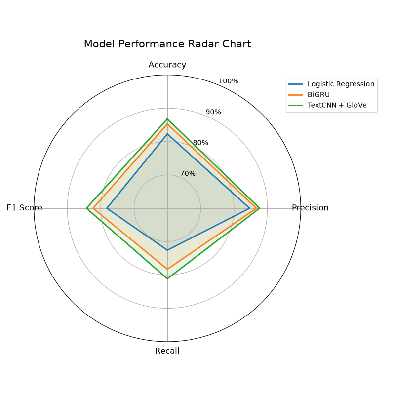

# 可解释谣言检测系统

## 项目简介

本项目为《人工智能导论》课程大作业，实现了对社交媒体推文的**谣言二分类检测**，并能**自动生成自然语言的判断依据**。

系统采用"传统检测模型 + 大语言模型解释"的复合架构：
- 检测模块：实现逻辑回归、RNN 等多种基线模型
- 解释模块：调用上海交通大学"致远一号"LLM API，生成可读的判断依据文本

对应大作业要求：
- **输出1**：检测输出为 2 分类（0 非谣言、1 谣言），分类准确率越高越好
- **输出2**：判断依据为一段中文文字，解释判断的理由

## 小组分工

| 成员   | 任务                                         | 主要代码目录                  |
| ------ | -------------------------------------------- | ----------------------------- |
| 简志辉 | 项目整合、文档撰写、实验分析、报告汇总         | `/`, `requirements.txt`, `report/`，`README.md` |
| 朱俊慷 | 逻辑回归模型开发、训练与评估                   | `models/lr_model.py`, `scripts/train_lr.py`, `scripts/predict_lr.py` |
| 李志政 | BiGRU与TextCNN + GloVe模型开发、训练与评估     | `models/bigru.py`, `models/textcnn.py`, `scripts/train_bigru.py`, `scripts/train_textcnn.py`, `utils/` |
| 马扬子 | LLM API 接入、提示词设计、解释模块封装         | `explanation/`, `config/llm_config.py`,`main.py`, `evaluate.py` |

## 环境配置

### 1. 基础环境

- Python 3.11
- PyTorch 2.4.0（或更高兼容版本）
- Windows / Linux / macOS

### 2. 安装依赖

```bash
pip install -r requirements.txt
```

主要依赖包：
- `torch==2.4.0`
- `pandas`
- `scikit-learn`
- `joblib`
- `requests`（用于 LLM API 调用）
- `python-dotenv`（环境变量配置）

### 3. Windows 环境注意事项

Windows 下运行时会遇到 Intel MKL/OpenMP 重复初始化的警告，需要在运行前设置环境变量：

**PowerShell：**
```powershell
$env:KMP_DUPLICATE_LIB_OK="TRUE"
python main.py --text "你的推文内容"
```

**CMD：**
```cmd
set KMP_DUPLICATE_LIB_OK=TRUE
python main.py --text "你的推文内容"
```

**永久解决**：在系统环境变量中添加 `KMP_DUPLICATE_LIB_OK=TRUE`。

## 数据集

- `data/train.csv`：训练集，字段包括 `id`, `text`, `label` (0非谣言/1谣言), `event`
- `data/val.csv`：验证集，字段相同

## 项目结构

```
├── main.py                   # CLI入口：检测+解释（单条/批量）
├── evaluate.py               # 批量评估：检测指标计算+结果保存
├── predictor.py              # 统一推理接口（→ 可解释性模块调用）
├── run_textcnn.py            # 训练入口（TextCNN + GloVe）
├── run_bigru.py              # 训练入口（BiGRU）
├── config/
│   ├── textcnn_config.py     # TextCNN 超参数
│   ├── bigru_config.py       # BiGRU 超参数
│   └── llm_config.py         # LLM API 配置
├── explanation/              # 可解释性模块（成员C）
│   ├── __init__.py           # 包入口
│   ├── llm_client.py         # LLM API 客户端（含重试机制）
│   ├── prompt_builder.py     # 提示词模板构建
│   └── explainer.py          # 核心解释器：检测模型 + LLM 编排
├── models/
│   ├── lr_model.py           # 逻辑回归模型
│   ├── bigru.py              # BiGRU 模型
│   └── textcnn.py            # TextCNN 模型 (Kim 2014)
├── utils/
│   ├── data_utils.py         # 分词、词表、Dataset/DataLoader
│   └── glove_utils.py        # GloVe 下载与 Embedding 矩阵构建
├── scripts/
│   ├── train_lr.py           # 逻辑回归训练
│   ├── predict_lr.py         # 逻辑回归推理
│   ├── train_bigru.py        # BiGRU 训练
│   ├── train_textcnn.py      # TextCNN + GloVe 训练
│   └── predict_bigru.py      # BiGRU 推理
├── data/
│   ├── train.csv             # 训练集 2,840 条
│   └── val.csv               # 验证集 401 条
├── checkpoints/              # 训练产物
│   ├── lr_model.pkl          # 逻辑回归模型 + 向量器
│   ├── bigru.pt / vocab.pt   # BiGRU 权重 + 词表
│   └── textcnn_glove.pt      # TextCNN 权重 + 词表
├── report/                   # 实验报告与可视化
│   ├── report.tex            # LaTeX 实验报告
│   ├── report.pdf            # 实验报告 PDF
│   ├── Figure_1.png          # 模型性能雷达图
│   ├── Figure_2.png          # 模型性能柱状图
│   └── Figure_3.png          # 混淆矩阵对比图
└── .env.example              # 环境变量模板
```

## 快速开始

### 1. 训练检测模型

```bash
# 逻辑回归（最快，~10 秒）
python scripts/train_lr.py

# BiGRU（~2 分钟）
python run_bigru.py

# TextCNN + GloVe（最优，~5 分钟，首次下载 GloVe ~822MB）
python run_textcnn.py
```
训练后模型保存在 checkpoints 文件夹下

### 2. 配置 LLM API（可选，仅需要解释功能时）

在项目根目录创建 `.env` 文件（参考 `.env.example`）：
```
LLM_API_KEY=你的交大API密钥
LLM_API_BASE=https://models.sjtu.edu.cn/api/v1
LLM_MODEL_NAME=deepseek-chat
```
详细API文档参考：[交大AI平台](https://claw.sjtu.edu.cn/guide/sjtu-api/)

### 3. 运行完整检测（含解释）

```bash
# 单条文本检测+解释（默认 TextCNN 模型）
python main.py --text "你的推文内容"

# 指定检测模型：textcnn / bigru / lr
python main.py --model textcnn --text "你的推文内容"
python main.py --model bigru --text "你的推文内容"
python main.py --model lr --text "你的推文内容"
```

> **Windows 注意**：首次运行前需设置环境变量，详见[环境配置](#3-windows-环境注意事项)。

示例输出：
```
=== Prediction ===
label: 1
confidence: 0.7278

explanation: 该推文使用"BREAKING"吸引眼球，且"hundreds feared dead"表述模糊，
             缺乏具体时间、来源或官方证实，符合未经验证谣言的常见特征。

--- JSON ---
{
    "label": 1,
    "confidence": 0.7278,
    "explanation": "该推文使用..."
}
```

输出说明：
- **Output 1**：检测输出 — 2分类结果（0=非谣言，1=谣言）及模型置信度
- **Output 2**：判断依据 — 一段自然语言文字，解释检测的判断依据

### 4. 批量评估验证集
```bash
# 评估验证集并计算指标
python evaluate.py --model textcnn --val-file data/val.csv

# 支持的模型：textcnn / bigru / lr
```


## 模型性能



### TextCNN + GloVe（最优）

| 指标 | 数值 |
|------|:--:|
| Accuracy | **86.78%** |
| Precision | 87.65% |
| Recall | 81.14% |
| F1 Score | 84.27% |

| 超参数 | 值 |
|------|-----|
| 词向量 | GloVe 6B 200d（预训练 + 微调），覆盖率 90.9% |
| 卷积核 | (2, 3, 4, 5)-gram × 256 |
| Dropout | 0.4 |
| Batch size | 32 |
| Learning rate | 5e-4 (Adam) |
| Weight decay | 2e-4 |
| 词表 | 2,727 (min_freq=2) |
| 参数量 | 1,264,249 |

### BiGRU

| 指标 | 数值 |
|------|:--:|
| Accuracy | 85.29% |
| Precision | 86.71% |
| Recall | 78.29% |
| F1 Score | 82.28% |

| 超参数 | 值 |
|------|-----|
| Embedding dim | 150 |
| Hidden dim | 200 |
| Dropout | 0.5 |
| Batch size | 32 |
| Learning rate | 5e-4 (Adam) |
| Weight decay | 3e-4 |
| 参数量 | 831,851 |

### 逻辑回归

| 指标 | 数值 |
|------|:--:|
| Accuracy | 82.29% |
| Precision | 84.67% |
| Recall | 72.57% |
| F1 Score | 78.15% |

| 超参数 | 值 |
|------|-----|
| 特征 | TF-IDF（max_features=10,000） |
| 模型 | LogisticRegression（max_iter=1,000） |
| 参数量 | 10,001 |


## 参考资源

- 交大 AI 平台 LLM API 文档：https://claw.sjtu.edu.cn/guide/sjtu-api/
- TextCNN 论文：Kim, Y. (2014). Convolutional Neural Networks for Sentence Classification
